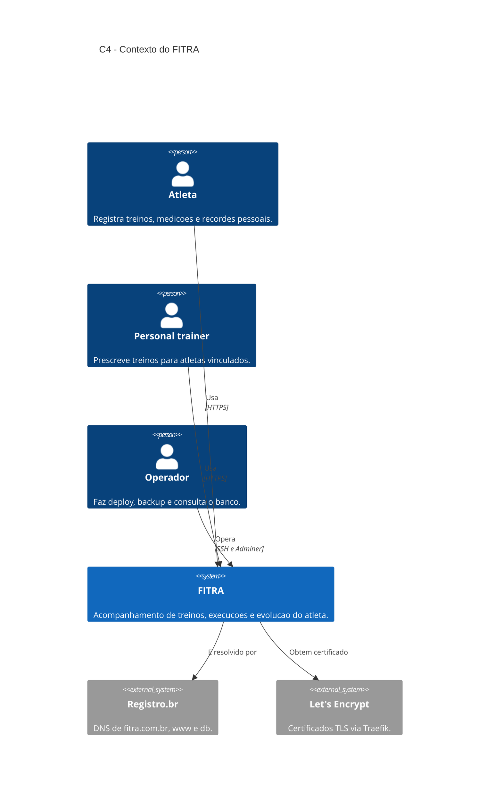
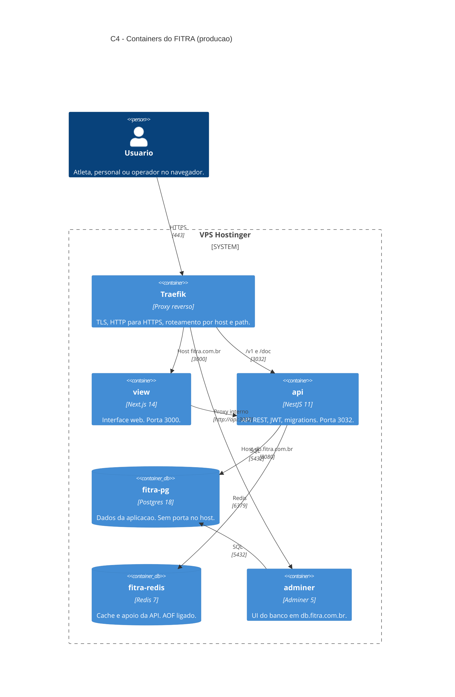

# FITRA - Infra

Infraestrutura para subir API, view, Postgres e Redis juntos.

O FITRA e uma plataforma de acompanhamento de treinos: atletas registram exercicios, medicoes e recordes pessoais. Este repositorio nao contem a aplicacao; ele orquestra os tres repositorios irmaos na mesma maquina.

```text
fitra/
  api/     NestJS (porta 3032)
  view/    Next.js (porta 3000)
  infra/   <- este repositorio
```

Na VPS o caminho esperado e `/opt/fitra/{api,view,infra}`.

## Como operamos

Producao roda em uma VPS Hostinger com Docker. O dominio `fitra.com.br` fica no [Registro.br](https://registro.br) e aponta o DNS (apex, `www` e `db`) para o IP da VPS.

Na borda usamos o Traefik ja existente na VPS (nao o Caddy). O Traefik descobre os containers pela API Docker, termina TLS com Let's Encrypt (`certresolver` `letsencrypt`) e encaminha o trafego:

| Host | Destino |
| --- | --- |
| `https://fitra.com.br` e `https://www.fitra.com.br` | view (Next.js) |
| `https://fitra.com.br/v1` e `/doc` | api (NestJS) |
| `https://db.fitra.com.br` | Adminer (Postgres na rede Docker) |

Postgres e Redis nao publicam porta no host. Persistencia fica em volumes Docker (`postgres_data`, `redis_data`). Deploy e `./deploy.sh prod` a partir de `/opt/fitra/infra`: build, sobe a stack e aplica migrations.

Localmente o Caddy substitui o Traefik na porta `8080`, para nao conflitar com outras stacks na `80`.

## Arquitetura C4

### Contexto

Pessoas e sistemas externos em volta do FITRA.



### Containers

Como o software e empacotado em producao. Traefik nao sobe neste compose; ele ja roda na VPS e entra pelos labels.



### Deploy

Onde cada peca vive.

```mermaid
C4Deployment
    title C4 - Deploy do FITRA

    Deployment_Node(dns, "Registro.br", "Zona DNS fitra.com.br") {
        Deployment_Node(records, "Registros A/CNAME", "apex, www, db -> IP da VPS")
    }

    Deployment_Node(hostinger, "Hostinger", "VPS com Docker") {
        Deployment_Node(opt, "/opt/fitra", "api, view e infra como irmaos") {
            Deployment_Node(traefik_node, "Traefik (ja existente)", "entrypoints web/websecure, certresolver letsencrypt") {
                Container(edge, "Roteamento", "Labels Docker", "fitra.com.br, www e db.fitra.com.br")
            }
            Deployment_Node(compose, "docker-compose.prod.yml", "Rede Docker da stack fitra") {
                Container(view_c, "fitra-view", "Next.js", ":3000")
                Container(api_c, "fitra-api", "NestJS", ":3032")
                ContainerDb(pg_c, "fitra-pg", "Postgres 18", "volume postgres_data")
                ContainerDb(redis_c, "fitra-redis", "Redis 7", "volume redis_data")
                Container(adminer_c, "fitra-adminer", "Adminer", ":8080")
            }
        }
    }

    Rel(records, hostinger, "Resolve para o IP publico")
    Rel(edge, view_c, "Demais paths")
    Rel(edge, api_c, "/v1 e /doc")
    Rel(edge, adminer_c, "db.fitra.com.br")
```

Em desenvolvimento, o Caddy (`Caddyfile`) ocupa o lugar do Traefik e escuta em `localhost:8080`. O arquivo `Caddyfile.prod` nao e usado na Hostinger.

## Deploy em um comando

No diretorio `infra`:

```bash
./deploy.sh dev
```

Com seed:

```bash
./deploy.sh dev seed
```

Producao:

```bash
cp .env.production.example .env.production
./deploy.sh prod
```

## 1) Subir ambiente local

```bash
cd /Users/alan/projects/fitra/infra
cp ../api/.env.example ../api/.env
./deploy.sh dev seed
```

Acessos locais:

- Frontend: `http://localhost:8080`
- API (via proxy): `http://localhost:8080/v1`
- Swagger (via proxy): `http://localhost:8080/doc`

O Caddy local usa a porta `8080` para nao conflitar com outras stacks (por exemplo AFM na `80`).
Postgres e Redis ficam so na rede Docker. Para `make dev` na API, use o container
avulso `fitra-postgres` na porta `5433` ou publique as portas no compose.

Somente banco e redis:

```bash
docker compose up -d fitra-pg fitra-redis
```

## 2) Rodar migrations e seed

O `deploy.sh` ja aplica migrations. Para rodar de novo:

```bash
docker compose exec api npm run apply-db-migrations
docker compose exec api npm run apply-db-seeds
```

Usuario admin criado pelo seed: `admin@admin.com` / `12345`.

## 3) Producao (VPS Hostinger)

Pre-requisitos: DNS no Registro.br apontando para a VPS, Traefik ativo com provider Docker e `certresolver` chamado `letsencrypt`.

1. Clone os tres repositorios como irmaos:

```bash
mkdir -p /opt/fitra
cd /opt/fitra
git clone git@github.com:miranda-alan/fitra-api.git api
git clone git@github.com:miranda-alan/fitra-view.git view
git clone git@github.com:miranda-alan/fitra-infra.git infra
```

2. Copie o template de producao:

```bash
cd /opt/fitra/infra
cp .env.production.example .env.production
```

3. Defina `APP_DOMAIN=fitra.com.br` e ajuste senhas e `JWT_SECRET`.

4. Suba os servicos:

```bash
./deploy.sh prod seed
```

Atualizacao depois do primeiro deploy: `git pull` nos tres repos e `./deploy.sh prod` de novo.

## 3.1) Adminer (gerenciar o banco pelo navegador)

O Postgres continua acessivel so na rede Docker. O Adminer entra pelo Traefik em
`https://db.fitra.com.br`, sem publicar `5432` no host.

1. Crie o DNS `db.fitra.com.br` apontando para o IP da VPS.
2. Suba (ou recrie) o servico:

```bash
cd /opt/fitra/infra
docker compose -f docker-compose.prod.yml --env-file .env.production up -d adminer
```

3. Acesse `https://db.fitra.com.br` e entre com:

- Sistema: `PostgreSQL`
- Servidor: `fitra-pg`
- Usuario: valor de `DATABASE_USER`
- Senha: valor de `DATABASE_PASSWORD`
- Base: valor de `DATABASE_NAME`

Nao use `127.0.0.1` nem o IP publico no campo servidor.

## 4) Logs e status

```bash
docker compose ps
docker compose logs -f api
docker compose logs -f view
```

Em producao:

```bash
docker compose -f docker-compose.prod.yml --env-file .env.production ps
docker compose -f docker-compose.prod.yml --env-file .env.production logs -f api view
```

## 5) Parar e limpar

```bash
docker compose down
# com volumes (cuidado: apaga banco e redis)
docker compose down -v
```

## 6) Checklist de go-live seguro

1. DNS resolvendo para a VPS

```bash
dig +short fitra.com.br
```

2. Certificado TLS valido e emitido pelo Let's Encrypt

```bash
echo | openssl s_client -connect fitra.com.br:443 -servername fitra.com.br 2>/dev/null | openssl x509 -noout -issuer -dates
```

3. Redirecionamento HTTP -> HTTPS funcionando

```bash
curl -I http://fitra.com.br
```

4. Containers da aplicacao saudaveis

```bash
docker compose -f docker-compose.prod.yml --env-file .env.production ps
```

5. Login funcionando via dominio publico

```bash
curl -i -s -X POST https://fitra.com.br/v1/auth/login \
	-H 'Content-Type: application/json' \
	-d '{"email":"admin@admin.com","password":"SENHA_ADMIN"}'
```

6. Swagger publico respondendo

```bash
curl -I https://fitra.com.br/doc
```

7. Verificacao de logs sem erro recorrente

```bash
docker compose -f docker-compose.prod.yml --env-file .env.production logs --tail=200 api view
```

8. Validacao de migrations (nao deve haver pendencias)

```bash
docker compose -f docker-compose.prod.yml --env-file .env.production exec -T api npm run apply-db-migrations
```

9. Backup manual de banco gerado com sucesso

```bash
docker compose -f docker-compose.prod.yml --env-file .env.production exec -T fitra-pg \
	pg_dump -U "$DATABASE_USER" "$DATABASE_NAME" | gzip > /opt/backups/fitra-$(date +%F).sql.gz
```

Se qualquer item falhar, nao avance para abertura oficial do sistema.

## 7) Preflight automatizado (PASS/FAIL)

```bash
cd /Users/alan/projects/fitra/infra
./preflight-prod.sh --admin-password "SUA_SENHA_ADMIN"
```

Opcoes uteis:

```bash
./preflight-prod.sh --skip-login
./preflight-prod.sh --admin-password "SUA_SENHA_ADMIN" --with-backup
```

O script retorna codigo 0 quando todos os testes passam, e codigo 1 quando ha falhas.

## 8) Dominio apex e www

O compose de producao atende `fitra.com.br` e `www.fitra.com.br`.
O Traefik pede um certificado Let's Encrypt com os dois nomes (SAN).

Apos atualizar os labels, recrie `api` e `view`:

```bash
cd /opt/fitra/infra
docker compose -f docker-compose.prod.yml --env-file .env.production up -d --force-recreate api view
```
